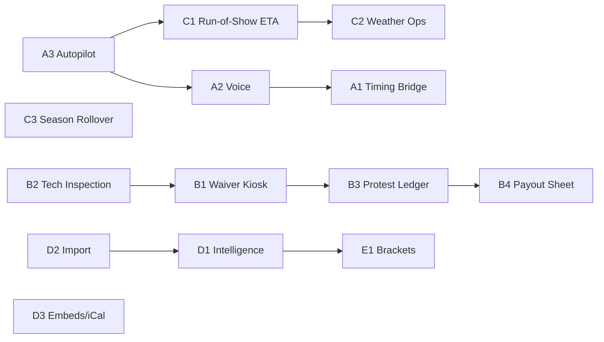

# Possible Phase 5: "Race Day Runs Itself"

**Theme:** Phases 1–4 made RaceHoller a strong *results* platform. Phase 5 makes it the **operating system for race day**, covering everything from the moment the gate opens until the last payout is signed. Competitors stop at results. We'll cover the whole night.

Every idea below follows the standing rules:
- No racer accounts, racer profiles, or racer payments. Only track/series owners and invited staff sign in.
- Track and series ownership stays exclusive. Identity is never inferred from venue text or racer names.
- All changes are appended and audited, nothing is silently overwritten, and checked RPCs enforce permissions.
- None of these repeat ideas from `creative.md`.

---

## Pillar A: Kill the Clipboard (scoring at the line)

### A1. Timing Bridge: plug timing hardware straight into the browser
Most small tracks still read times or distances off a timing box and type them in by hand, and typos cause disputes. With the Timing Bridge, staff plug the timing system into the scoring device over USB/serial (the **Web Serial API**, supported in Chromium desktop browsers like Chrome and Edge). Each reading fills in the pending attempt for the entry currently up, and staff confirm with one big button.

- **Architecture:** A `timing_adapters` registry that works like the scoring registry: one parser per hardware protocol, versioned and unit-tested, and it fails clearly when a format is unsupported.
- **Offline:** Readings go into the existing offline attempt queue, so a cell-signal drop loses nothing.
- **Honest limitation:** iPads and Safari don't support Web Serial or Web Bluetooth. iPad-heavy tracks would need a small bridge app or a laptop at the timing booth.
- **Why it wins:** "Plug in your timer and stop typing" is a switching reason in one sentence.
- **Effort:** L. This needs real hardware to test, so start with the 1–2 most common systems your customers use.

### A2. Voice Scoring for hands-busy staff
The scorer says *"Forty-two. Fifty-two feet four inches."* The app parses that with the **existing** feet/inches distance parser, shows the result in giant text, and saves it after a single tap.

- Uses the browser Speech Recognition API. Most browsers need a connection for this, so the keypad stays as the fallback.
- Voice never saves on its own. A human always confirms, which keeps the existing rule that blank, DNF, and DQ are never silently turned into a pass.
- **Effort:** M.

### A3. Running-Order Autopilot
After each attempt is saved, the next entry in running order automatically moves into the "up now" slot on the scorer, pit display, and spectator pages. Skips, re-runs, and "send to back of class" are one-tap actions, each with a reason that goes into the audit log.
- **Effort:** S–M. It builds on the existing running-order editor.

---

## Pillar B: The Gate-to-Payout Pipeline (staff-run race day)

### B1. Digital Waiver Kiosk (staff device, no racer account)
Every track deals with insurance waivers on soggy paper. In kiosk mode, a staff member enters the contestant (the existing staff-only registration) and then hands the tablet over. The contestant reads the track's waiver, signs with a finger, and hands the tablet back. **No login and no account is created.** The signature, timestamp, waiver version, and the staff member who ran the kiosk are stored against the event entry.

- Minor-participant flow with a guardian signature.
- Owners can export every signed waiver for a race as one PDF for their insurance carrier.
- **Fits Rule B:** Staff are still the only ones registering contestants. The kiosk only collects a signature on a staff-controlled device.
- **Effort:** M. Needs Supabase Storage for signature images and a waiver version history.
- ⚠️ Get the track's own insurance or legal approval of the waiver text. RaceHoller provides the tool, not legal advice.

### B2. Tech Inspection Station
Each class gets a configurable inspection checklist, such as weight limit, tire size, kill switch, helmet rating, or fire extinguisher. Inspectors work through it on a phone at the tech shed: pass, fail, or fix-and-recheck, with optional photos and a recorded weigh-in value.

- **Staging gate:** An entry that hasn't passed tech shows a red badge in staging. The owner can choose "warn only" or "block."
- Failed-tech history is visible within the owner's own events only. This keeps the isolation between tracks and series.
- **Effort:** M.

### B3. Protest & Ruling Ledger
Today, disputes get settled by whoever yells loudest. With the ledger, staff log a protest against an attempt or entry, and an official records the ruling (upheld, denied, or penalty applied) with a plain-English explanation. Any score change goes through the existing revision and official-version system.

- Owners can choose to show a public **"Official Rulings" board** on the spectator page. That kind of transparency builds trust with racers.
- **Event Replay:** A timeline view of every attempt, edit, ruling, and status change during the race, built from audit data that already exists. It settles "the scorer changed my time" arguments.
- **Effort:** M.

### B4. Purse & Payout Settlement Sheet (record-keeping only)
Tracks already pay cash prizes by overall placing, and the handoff rule says race money follows *all* entrants, not only series members. Owners set up a purse per class: fixed amounts, a percentage of a declared pot, and how ties split. RaceHoller produces the payout sheet, and each racer signs on the staff tablet when they're paid.

- **No money moves through RaceHoller.** It's a ledger for the promoter's own cash and checks, which keeps the rule against contestant payments.
- A year-end payout report per payee helps with tax paperwork. Owners set their own reporting threshold, so they should confirm it with their accountant.
- **Effort:** M.
- ❓ **Needs your OK:** This keeps payee names and amounts. Decide whether you want that data on the platform.

---

## Pillar C: Plan the Night, Predict the Night

### C1. Run-of-Show Planner with live ETA prediction
Racers in the pits and fans in the stands all ask the same thing: *"When is my class up?"* RaceHoller learns each class's average time between attempts from past events and predicts start times, such as *"Pro Mod: ~8:40 PM."* The estimate updates live as the night runs ahead or behind.

- **Promoter view:** "You're running 22 minutes behind. Cutting intermission to 10 minutes recovers 15."
- **Public view:** A "What's next" strip on spectator pages. No accounts are needed to see it.
- **Required schema change:** `attempts` has **no timestamp** today (the pit display had to work around this). Add a `recorded_at timestamptz default now()` column. It improves auditing too.
- **Effort:** M. Starts simple with averages, and predictions improve as data builds up.

### C2. Weather Ops Center
Track owners automatically see the forecast and radar for their venue (from the free National Weather Service API at `api.weather.gov`; it covers the US only).

- **One-tap "Weather Hold":** A banner appears on every spectator page and pit display, and the run-of-show ETAs pause.
- **Rain-Out Wizard:** Moves a race to a new date, keeps every entry and the running order, notes the reason, and leaves series points rules untouched.
- Real-time lightning-strike data needs a paid provider and would be a later add-on.
- **Effort:** M. A new `postponed` lifecycle state has to fit carefully with the existing lifecycle RPCs.

### C3. Season Rollover Wizard (tied directly to billing)
Your billing model is a manual yearly season pass. Make renewing feel like a gift instead of a chore: right after a Season Pass purchase, the wizard offers to **copy last season** — classes, points rules, bonuses, and a schedule shifted to the same weekdays next year. Series registrations still start fresh, which keeps the "new season, new registrations" rule.
- **Why it wins:** The renewal payment *is* the moment of value. Churn drops because setting up a new season takes 5 minutes.
- **Effort:** S–M.

---

## Pillar D: Grow the Promoter's Business

### D1. Promoter Intelligence Dashboard (Premium tier)
- **Car-count trends** per class, by event and by season.
- **Class Health score:** A warning like *"Super Stock has averaged 3 entries for 4 races. Consider merging it with Street Stock."*
- **Retention:** Which series registrations came back season over season. This uses **registration IDs only**. Name matching is offered only as a suggestion the owner must confirm, which keeps the "never infer identity from names" rule.
- **Effort:** M. This makes the Premium tier obviously worth the money.

### D2. Migrate-From-Anywhere Import
Switching costs keep tracks on legacy systems. An import wizard takes CSV or Excel files of past results, rosters, and points from spreadsheets or competitor exports. It walks through column mapping, previews the data, validates it, and imports it in one transaction (all or nothing) with an import record in the audit log.
- Historical points come in as **manual adjustments with explanations**, which fits the existing points-history model.
- **Why it wins:** *"Bring your last 3 seasons over in 10 minutes."*
- **Effort:** M.

### D3. Embeds, SEO & Calendar Feeds
- **Embeddable widgets:** A copy-paste snippet that shows live results, standings, or the schedule on the track's own Wix, WordPress, or Squarespace site.
- **Structured data:** schema.org `SportsEvent` markup on public race pages so Google can show race dates and venues in search results.
- **iCal feed:** Fans subscribe to a track's schedule in Google Calendar or Apple Calendar, and rain-out reschedules (C2) update it automatically.
- **Effort:** S–M. Cheap to build with a big discovery payoff.

---

## Pillar E: Major Scoring Expansion

### E1. Heads-Up Brackets & Elimination Ladders (✅ COMPLETED)
- **Bracket Generator:** Standard NCAA/NHRA tournament elimination ladder (powers of 2: 2, 4, 8, 16, 32, 64) with automatic byes awarded to top seeds for uneven fields.
- **Matchup Resolution:** Head-to-head match scoring round by round. Lower adjusted elapsed time (including penalties) advances; valid runs beat DQ/DNF/DNS; solo bye advances automatically.
- **Live Bracket View:** Responsive, high-contrast tournament ladder component (BracketView) on both spectator leaderboards (/r/[slug]/[eventSlug]) and Pit Display (/pit-display), with instant toggle between elimination bracket and leaderboard table views.
- **Scoring Desk Integration:** Dynamic bracket pairings helper on scoring workspace showing upcoming round pairings and match outcomes.
- **Scoring & Ranking Contracts:** Ships as head_to_head in the shared registry. Full ranking contracts preserved: Champion (1st), Runner-Up (2nd), Semifinalists (3rd/4th broken by round elapsed times), with CSV export, finalization, and championship standings working seamlessly.

---

## Moonshot (prototype only if Phase 5 goes well)

### Dead-Zone Mode: multi-device sync with no internet
Touring series often run at venues with zero signal. One staff device acts as the **hub**, and other staff devices join over the hub's local Wi-Fi hotspot by scanning a pairing QR code. Attempts sync across devices locally, then upload to Supabase once any device gets a signal, with conflicts resolved by the existing revision and 409 conflict rules.
- **Effort:** XL. Local networking in browsers is difficult. A small native companion app may be needed.

---

## Feature-to-tier map (gives customers a reason to upgrade)

| Feature | Event Pass | Standard | Premium |
|---|:-:|:-:|:-:|
| Running-Order Autopilot, Voice Scoring | ✅ | ✅ | ✅ |
| Waiver Kiosk, Tech Inspection | ✅ | ✅ | ✅ |
| Timing Bridge | ✅ | ✅ | ✅ |
| Protest Ledger + Event Replay | — | ✅ | ✅ |
| Run-of-Show ETA, Weather Ops | — | ✅ | ✅ |
| Season Rollover Wizard | — | ✅ | ✅ |
| Embeds / iCal / SEO | ✅ basic | ✅ | ✅ |
| Purse & Payout Settlement | — | ✅ | ✅ |
| Promoter Intelligence | — | — | ✅ |
| Heads-Up Brackets | — | ✅ | ✅ |
| Migrate-From-Anywhere Import | — | ✅ | ✅ |

*The tier placements are a starting suggestion and are your call.*

---

## Suggested build order

| Wave | Contents | Why this order |
|---|---|---|
| **5A: Quick wins** | A3 Autopilot, C3 Season Rollover, D3 Embeds/iCal, `recorded_at` column | Visible improvements, low risk, and C3 supports renewals |
| **5B: Race-day ops** | B2 Tech, B1 Waivers, C1 ETA, C2 Weather | The "operating system for race day" story |
| **5C: Trust & money** | B3 Protests/Replay, B4 Payouts, D2 Import | Fewer disputes, lower switching costs |
| **5D: Big bets** | A2 Voice, A1 Timing Bridge, D1 Intelligence, E1 Brackets | Biggest differentiators, highest effort |

---

## Decisions needed from you

1. **Payout ledger (B4):** Is keeping payee names and prize amounts on the platform acceptable?
2. **Waivers (B1):** Do you want to provide a default waiver template, or require every track to upload its own?
3. **Timing hardware (A1):** Which timing systems do your target tracks actually use? This decides which adapters to build first.
4. **Brackets (E1):** Which event types should brackets support first?
5. **Tier map:** Do you agree with the feature-to-tier placements above?

